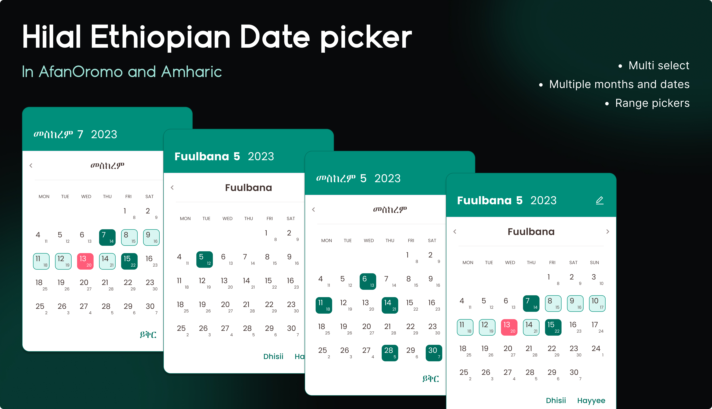

# Ethiopian Date Picker Flutter Plugin


*Design by [Firaol Andarge UI/UX Designer](https://www.linkedin.com/in/fraol-andarge-828643261/)*

A **simplified** Ethiopian Date Picker Flutter Plugin with **no state management dependencies**. Built on the renowned Abushakir plugin, this tool provides comprehensive date picking functionality for Flutter applications with full support for Ethiopian calendar system.

## ✨ Key Improvements in v1.1.0

- **No State Management Required** - No BLoC, Provider, or any state management setup needed
- **Simple Integration** - Just import and use with callback functions

## Features

- ✅ **Multi-language Support**: Amharic, Afan Oromo, and English
- ✅ **Ethiopian Calendar System** with Gregorian conversion display
- ✅ **Single Date Selection** and **Date Range Selection** (long press to start range)
- ✅ **Events Calendar** with customizable event display and multiple date support
- ✅ **Year Picker with Edit Button** - Easy year navigation for all languages (Amharic, Oromo, English)
- ✅ **Gesture Navigation** - Swipe between months
- ✅ **Customizable Colors** and styling
- ✅ **No External Dependencies** - Works out of the box

## Quick Start

### Installation

Add this to your `pubspec.yaml`:

```yaml
dependencies:
  ethiopiandatepickerandconvertor: ^1.1.0
```

### Basic Usage

#### 1. Simple Date Picker

```dart
import 'package:ethiopiandatepickerandconvertor/ethiopiandatepickerandconvertor.dart';

// Show date picker dialog
showDialog<List<String>>(
  context: context,
  builder: (_) {
    return SimpleDatePicker(
      displayGregorianCalender: true,
      userLanguage: "am", // "am", "ao", or "en"
      startYear: 1990,
      endYear: 2030,
      todaysDateBackgroundColor: Colors.greenAccent,
      onDatesSelected: (selectedDates) {
        print('Selected dates: $selectedDates');
        // Handle selected dates here
      },
    );
  },
);
```

#### 2. Calendar with Events

```dart
// Navigate to calendar page
Navigator.push(
  context,
  MaterialPageRoute(
    builder: (context) => SimpleCalendarWithEvents(
      borderColor: Colors.yellow,
      todaysDateColor: Colors.purpleAccent,
      displayGregorianCalender: true,
      userLanguage: "ao", // Supports "am", "ao", "en"
      startYear: 1990,
      endYear: 2030,
      eventsList: [
        // Single date events (format: 'YEAR-MONTH-DAY')
        {'date': '2018-1-15', 'title': 'New Year Event', 'description': 'Ethiopian New Year Celebration'},
        {'date': '2018-2-10', 'title': 'Meeting', 'description': 'Team meeting at 10 AM'},
        {'date': '2018-12-30', 'title': 'Year End Party', 'description': 'End of year celebration'},
        // Multiple dates event
        {'dates': ['2018-5-1', '2018-5-2', '2018-5-3'], 'title': 'Conference', 'note': '3-day event'},
      ],
      onEventTap: (eventData) {
        print('Event tapped: $eventData');
        // Handle event tap
      },
    ),
  ),
);
```

**Features:**
- Year picker accessible via edit icon button in header for all languages
- Events marked with colored borders and event count badges
- Tap on event dates to view details
- Supports both Gregorian and Ethiopian date display

#### 3. Date Converter (NEW!)

```dart
import 'package:ethiopiandatepickerandconvertor/ethiopiandatepickerandconvertor.dart';

// Convert Ethiopian to Gregorian
Map<String, int> gregorian = DateConverter.ethiopianToGregorian(
  year: 2016,
  month: 4,
  day: 15,
);
print('Gregorian: ${gregorian['day']}/${gregorian['month']}/${gregorian['year']}');

// Convert Gregorian to Ethiopian
Map<String, int> ethiopian = DateConverter.gregorianToEthiopian(
  year: 2023,
  month: 12,
  day: 25,
);
print('Ethiopian: ${ethiopian['day']}/${ethiopian['month']}/${ethiopian['year']}');

// String-based conversion with validation
String gregorianStr = DateConverter.ethiopianToGregorianString('15/4/2016');
String ethiopianStr = DateConverter.gregorianToEthiopianString('25/12/2023');

// Get today's Ethiopian date
String today = DateConverter.getTodayEthiopianString();
```

#### 4. Ethiopian Time Viewer (NEW!)

```dart
// Display Ethiopian time with real-time updates
EthiopianTimeViewer(
  language: 'am', // 'am', 'ao', or 'en'
  timeStyle: TextStyle(fontSize: 32, fontWeight: FontWeight.bold),
  backgroundColor: Colors.white,
)
```

Ethiopian time format:
- Day (ቀን): 6 AM - 6 PM Western time
- Night (ሌሊት): 6 PM - 6 AM Western time
- 12-hour format starting at sunrise/sunset

#### 5. Age Calculator (NEW!)

```dart
// Calculate age from Ethiopian birthdate
String age = DateConverter.getEthiopianAgeString(
  birthYear: 2000,
  birthMonth: 1,
  birthDay: 1,
  language: 'am', // Returns: "16 ዓመት, 3 ወር, 15 ቀን"
);

// Calculate age from Gregorian birthdate
String gregorianAge = DateConverter.getGregorianAgeString(
  birthYear: 2007,
  birthMonth: 9,
  birthDay: 11,
  language: 'en', // Returns: "16 years, 3 months, 15 days"
);
```

## Language Support

- `"am"` - Amharic (አማርኛ)
- `"ao"` - Afan Oromo (Afaan Oromoo)
- `"en"` - English

## API Reference

### SimpleDatePicker

| Parameter | Type | Description |
|-----------|------|-------------|
| `displayGregorianCalender` | `bool` | Show Gregorian dates alongside Ethiopian |
| `userLanguage` | `String` | Language: "am", "ao", or "en" |
| `startYear` | `int` | Minimum selectable year |
| `endYear` | `int` | Maximum selectable year |
| `todaysDateBackgroundColor` | `Color` | Background color for today's date |
| `onDatesSelected` | `Function(List<String>)` | Callback with selected dates |

**Year Picker Feature:**
- Tap the edit icon in the header to open year picker
- Available for all languages (Amharic, Oromo, English)
- Horizontal scrollable grid layout for easy year selection

**Date Selection:**
- **Single tap**: Select individual dates
- **Long press**: Start range selection (long press start date, then end date)

### SimpleCalendarWithEvents

| Parameter | Type | Description |
|-----------|------|-------------|
| `eventsList` | `List<Map<String, dynamic>>` | Events with date/dates, title, description, note |
| `onEventTap` | `Function(String)` | Callback when event is tapped |
| `borderColor` | `Color` | Border color for event dates |
| `todaysDateColor` | `Color` | Background color for today |
| `headerBackgroundColor` | `Color?` | Optional header background color |
| `headerTextColor` | `Color?` | Optional header text color |
| `monthNavigationColor` | `Color?` | Optional month navigation color |
| `displayGregorianCalender` | `bool` | Show Gregorian dates alongside Ethiopian |
| `userLanguage` | `String` | Language: "am", "ao", or "en" |
| `startYear` | `int` | Minimum selectable year |
| `endYear` | `int` | Maximum selectable year |

**Year Picker Feature:**
- Tap the edit icon in the header to open year picker
- Available for all languages (Amharic, Oromo, English)
- Horizontal scrollable grid layout for easy year selection

### DateConverter (Static Methods)

| Method | Parameters | Returns | Description |
|--------|-----------|---------|-------------|
| `ethiopianToGregorian` | `year, month, day` | `Map<String, int>` | Convert Ethiopian to Gregorian |
| `gregorianToEthiopian` | `year, month, day` | `Map<String, int>` | Convert Gregorian to Ethiopian |
| `ethiopianToGregorianString` | `dateString` | `String` | Convert with format validation |
| `gregorianToEthiopianString` | `dateString` | `String` | Convert with format validation |
| `getTodayEthiopian` | - | `Map<String, int>` | Get current Ethiopian date |
| `getTodayEthiopianString` | - | `String` | Get formatted Ethiopian date |
| `getEthiopianAgeString` | `birthYear, birthMonth, birthDay, language` | `String` | Calculate age from Ethiopian date |
| `getGregorianAgeString` | `birthYear, birthMonth, birthDay, language` | `String` | Calculate age from Gregorian date |

### EthiopianTimeViewer

| Parameter | Type | Description |
|-----------|------|-------------|
| `language` | `String` | Language: "am", "ao", or "en" |
| `timeStyle` | `TextStyle?` | Style for time display |
| `periodStyle` | `TextStyle?` | Style for day/night indicator |
| `backgroundColor` | `Color?` | Background color |
| `padding` | `EdgeInsetsGeometry?` | Widget padding |

## 🎯 Live Examples

### Example 1: Basic Implementation
See `/example` folder for basic usage of both widgets with all language support.


**Features demonstrated:**
- 🌍 **Full Multi-language Support** (አማርኛ/Afaan Oromoo/English)
- 📅 **Ethiopian Calendar Integration** with Gregorian conversion
- 📊 **Event Calendar** showing medication reminders
- 🔄 **Dynamic Language Switching** affects calendar interface
- ✨ **Zero State Management** - shows how simple integration can be

**Key Demo Points:**
```dart
// Simple date selection for medication schedules
SimpleDatePicker(
  userLanguage: "am", // Switches calendar to Amharic
  displayGregorianCalender: true,
  onDatesSelected: (dates) => saveMedicationSchedule(dates),
)

// Calendar with medication events
SimpleCalendarWithEvents(
  eventsList: medicationEvents,
  userLanguage: currentLanguage, // Dynamic language switching
  onEventTap: (data) => showMedicationReminder(data),
)

// Date converter with age calculator
DateConverterScreen(
  language: currentLanguage,
  // Includes date conversion and age calculation
)

// Ethiopian time display
EthiopianTimeViewer(
  language: currentLanguage,
)
```

**Perfect for:**
- Cultural calendar applications
- Educational projects

👨‍⚕️ **Cultural Relevance**: Shows how traditional Ethiopian calendar can be seamlessly integrated into modern healthcare applications, making technology more accessible to Ethiopian communities.


## 🚀 Installation

Add to your `pubspec.yaml`:

```yaml
dependencies:
  ethiopiandatepickerandconvertor: ^1.1.0
```

Then run:
```bash
flutter pub get
```

**No additional dependencies required!** The library works out of the box without any state management setup.

## 🤝 Contributing

Contributions are welcome! Please feel free to submit a Pull Request.

## 📄 License

This project is licensed under the MIT License - see the LICENSE file for details.

## 🙏 Acknowledgments

- Built on the renowned [Abushakir](https://pub.dev/packages/abushakir) Ethiopian calendar library
- UI/UX Design by [Firaol Andarge](https://www.linkedin.com/in/fraol-andarge-828643261/)
- Community feedback and testing

## 📞 Support

For issues, feature requests, or questions:
- 🐛 [Report Issues](https://github.com/KhalidMeftu/ethiopiandatetimepickerandconverter/issues)
- 📧 Email: [khalidmeftu@gmail.com]

---

**Made with ❤️ for the Ethiopian developer community** 🇪🇹

