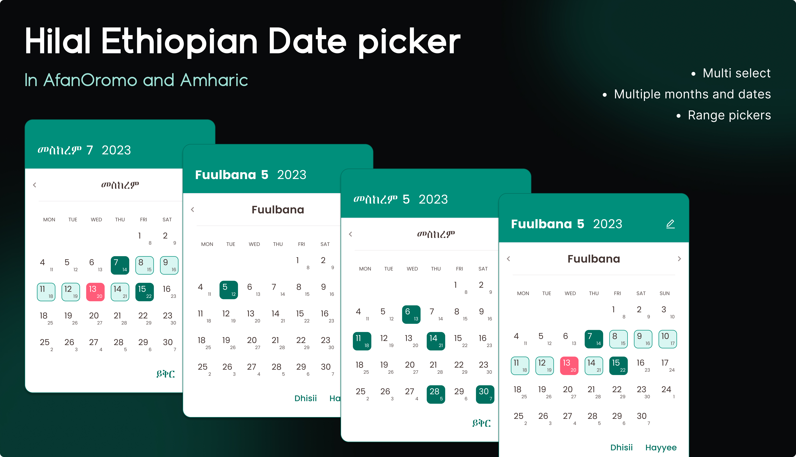

# Hilal Ethiopian Date Picker Flutter Plugin for AfanOromo and Amharic

 
designed by [Firaol Andarge UI/UX desiner ](https://www.linkedin.com/in/fraol-andarge-828643261/)
Hilal Ethiopian Date Picker Flutter Plugin is based on renawoned Abushakir plugin a powerful and versatile tool designed specifically for Flutter developers looking to incorporate date picking functionality into their applications with support for AfanOromo and Amharic languages. This plugin not only enables users to select single dates but also facilitates the selection of date ranges across multiple months, making it highly flexible and user-friendly.

One of the standout features of this plugin is its ability to display an events calendar, which provides users with a visual representation of important dates and events. This functionality allows developers to seamlessly integrate event management systems or display significant dates relevant to their application's purpose.

Additionally, the Hilal Ethiopian Date Picker Flutter Plugin includes a random date picker feature. This feature enables users to generate random dates within a specified range, which can be particularly useful for applications that require generating random events, scheduling appointments, or conducting data analysis.


## Features

- Supports AfanOromo and Amharic languages for a localized experience.
- Enables selection of single dates and ranges across multiple months.
- Displays an events calendar to visualize important dates and events.
- Includes a random date picker for generating random dates within a specified range.
- Highly customizable and adaptable to match the application's design and branding.
- Offers intuitive and user-friendly interface for seamless integration into Flutter applications.
- Options to display Gregorian calendar.
- Options to pass parameter.
- Events Calender.


## Installation

installation is copy the lib from pub dev https://pub.dev/packages/ethiopiandatepickerandconvertor

So the plugin requires flutter bloc dependency to oprate since all vast logics are handled by state management and am confratable with it also if you are using provider or getx any other state management don't worry it works fine with others without any prooblem. So insatall Bloc first. pub get your dependency

```
  
 dependencies:
  ...
  flutter_bloc:latest version
  ethiopiandatetimepickerandconverter:latest version
 
```
imports
```
import 'package:ethiopiandatepickerandconvertor/controller/alert_calender_bloc/alert_calender_controller_bloc.dart';
     
```
then wrap your material app with MultiBloc provider.

```
     return MultiBlocProvider(
      providers: [
        BlocProvider(
          create: (context) => AlertCalenderControllerBloc(),
        ),
       
      ],
      child: MaterialApp(
        title: 'Flutter Demo',
        
        home: HomePage(),
      ),
    );

 ```
 for Getx users
 ```
     return MultiBlocProvider(
      providers: [
        BlocProvider(
          create: (context) => AlertCalenderControllerBloc(),
        ),
      
      ],
      child: GetMaterialApp(
        title: 'Flutter Demo',
        
        home: HomePage(),
      ),
    );

 ```
 for provider users 
  ```
 runApp(MultiBlocProvider(providers: [
    BlocProvider(
          create: (context) => AlertCalenderControllerBloc(),
        ),
        
    ),
    ...
   ], 
child: 
MultiProvider(
  providers: [
    Provider<Something>(create: (_) => Something()),
    Provider<SomethingElse>(create: (_) => SomethingElse()),
    Provider<AnotherThing>(create: (_) => AnotherThing()),
  ],
  child: MyApp(),
)));
 ```
## Usage/For Hilal Ethiopian Picker

Range and date picker is an alert form so since the lib will be triggered from Todays date it will be triggred using bloc and when user clicks okay the libriary will return picked values let us see them

```
import 'package:ethiopiandatepickerandconvertor/controller/alert_calender_bloc/alert_calender_controller_bloc.dart';
import 'package:ethiopiandatepickerandconvertor/widgets/calender_wevent_widget.dart';
import 'package:ethiopiandatepickerandconvertor/widgets/date_picker_alret.dart';
import 'package:flutter_bloc/flutter_bloc.dart';

 ElevatedButton(
            onPressed: () async {
              List? val = await showDialog<List>(
                context: context,
                builder: (_) {
                  return BlocProvider.value(
                    value:
                    BlocProvider.of<AlertCalenderControllerBloc>(context),
                    child: AlertDatePicker(
                      displayGregorianCalender: false,/// boolean value to display ethiopian calender with gregorian calender true will display flase will remove from calender
                      userLanguage: "ao",/// user  language is String value ao means it loads AfanOromo am will show amharic calender
                      startYear: 1990,/// this value is must but start year is where your calender starts to count
                      endYear: 2020, /// this value is  must also but end year is where your calender ends to count
                      todaysDateBackgroundColor: Colors.greenAccent,
                      /// todaysDateBackgroundColor is Color helps you to mark todays date on calender.
                    ),
                  );
                },
              );
              print('Dialog one returned value ---> $val');
// so if user selects on range base 1-3 upon okay click the calender returns dates 
//Dialog one returned value ---> [2016-1-1, 2016-1-2, 2016-1-3, ]
/// so get this save with user tasks thats all the some for tap

            },
            child: const Text('Show Dialog One'),
          ),
```

Next we  will show user tasks on calender  first  note this doesn't doesnt support adding tasks for example you can add holiday dates from server which will help incase of Islamic holidays and other which calender will move moon and Ethiopian 13 month.
So you can pass unlimited data like
```
 List<Map<String, String>> events = [
    {'date': '2015-12-28', 'title': 'Event 1', 'description': 'Description 1'},
    {'date': '2015-5-1', 'title': 'Event 2', 'description': 'Description 2'},
    {'date': '2015-12-24', 'title': 'Event 3', 'description': 'Description 2'},
    {'date': '2015-13-3', 'title': 'Event 4', 'description': 'Description 4'},
  ];
  ```
  events should be passed in List Map  so you can call on your widget inside container and you can show here is how to call it
  ```
  BlocProvider.value(
                    value:
                        BlocProvider.of<AlertCalenderControllerBloc>(context),
                    child: CalenderWithEventWidget(
                      borderColor: Colors.yellow,
                      todaysDateColor: Colors.purpleAccent,
                      displayGregorianCalender: true,
                      userLanguage: "ao",
                      startYear: 1990,
                      endYear: 2020,
                      eventsList: events,
                      sendUserEventData: (data) {
                        print("Received data: $data");
                        /// if you need Toast show Scaffold whatever
                      },
                    ),
                  ),
  ```
border color is Color type parameter and it will mark border color specific date with event.
todaysDateColor: is some as above 
eventsList: events, list of your events.

## Acknowledgements

 - [Firaol Andarge UI/UX desiner ](https://www.linkedin.com/in/fraol-andarge-828643261/)
 - [Authors of Abushakir](https://pub.dev/packages/abushakir)
 


## Contact Me
khalidmeftu@gmail.com
## License
This project is licensed under the MIT License - see the [LICENSE.md](https://github.com/KhalidMeftu/ethiopiandatetimepickerandconverter/blob/master/LICENSE.md)

